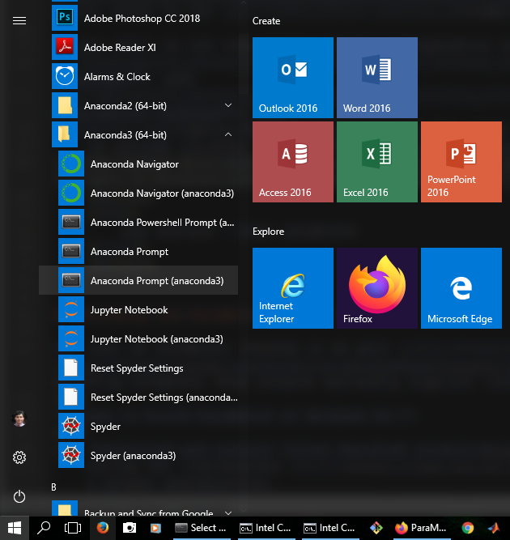


[](){:target="_blank"}



<br>


{% include tip.html content="The Python distribution that we recommend you to use is [Anaconda Python 3](https://www.anaconda.com/distribution/#download-section). Anaconda Python automatically ships with all the external module dependencies of the ParaMonte Python library, which are not that many (e.g., `numpy`, `scipy`, `pandas`, `matplotlib`, `seaborn`). Once Anaconda is installed on your system, find and open an Anaconda-provided Windows command-prompt from the Windows startup, as shown in the figure below.  
<br>
<figure>
    
</figure>
" %}  

<br>

There are three ways to install and use the ParaMonte library from Python:  

## The fastest way  

Install the latest release of the ParaMonte Python library via the [Python Package Index (PyPI)](https://pypi.org/project/paramonte/){:target="_blank"}. To do so,
  
1.  Open an Anaconda command-prompt (on Windows) or a Bash shell (on Unix-like OS such as Linux or Darwin/macOS), then type,  
```shell
pip install --user --upgrade paramonte
```  
This will install the Python interface to ParaMonte on your system along with any dependencies. If you are inside an `ipython` or `jupyter` session, try instead,  
```shell
!pip install --user --upgrade paramonte
```  
1.  Then, open a Python (or `ipython` or `jupyter`) session and type,  
```shell
import paramonte as pm
```  
1.  The ParaMonte Python library is ready to use!

## The fast way  

1.  Download and unzip the prebuilt Python package for ParaMonte from the project repository's release page on GitHub:  
    +   for **Windows**: [libparamonte_python_windows_amd64.zip]({{site.githubReleaseCurrentDownload}}/libparamonte_python_windows_amd64.zip).    
    +   for **Linux**: [libparamonte_python_linux_amd64.tar.gz]({{site.githubReleaseCurrentDownload}}/libparamonte_python_linux_amd64.tar.gz).  
    +   for **macOS**: [libparamonte_python_darwin_amd64.tar.gz]({{site.githubReleaseCurrentDownload}}/libparamonte_python_darwin_amd64.tar.gz).  
    +   for **macOS**: [libparamonte_python_darwin_arm64.tar.gz]({{site.githubReleaseCurrentDownload}}/libparamonte_python_darwin_arm64.tar.gz).  
        {{site.data.alerts.important}}
        If you are a <b>macOS user</b>, we <b>strongly recommend you to NOT download</b> the library directly from the library's GitHub release page and <b>NOT by clicking directly on the above link</b>. Instead, use the <b><code>curl</code></b> command line program to download your the library from the release page. To do so, first make sure you have <b><code>curl</code></b> installed on your system. If it is not installed, you can install it via <a href="https://brew.sh/" target="_blank">Homebrew</a>,
        <br>
        <pre>
        brew install curl
        </pre>
        Then, copy the web-link to the ParaMonte Python library and download it via <b><code>curl</code></b> to the current folder. For example,  
        <pre class="language-bash highlighter-rouge">
        libname=libparamonte_python_darwin_amd64
        curl -OL {{site.githubReleaseCurrentDownload}}/$libname.tar.gz
        tar xvzf $libname.tar.gz && cd $libname
        </pre>
        {{site.data.alerts.end}}
1.  Open an Anaconda command-prompt (on Windows) or a Bash shell (on Unix-like OS such as Linux or Darwin/macOS).  
1.  Change the working directory of your shell environment to the unzipped directory of the ParaMonte Python library, such that when you list the contents of your current working directory, you see a subdirectory named **`paramonte`**. This subdirectory contains the Python module interface to the ParaMonte library.  
1.  Open an **`ipython`** or **`jupyter`** session in this environment, and type **`import paramonte as pm`**.  
1.  Congratulations! you have successfully installed the Python interface to the ParaMonte library on your system.  
  
  

## The long way  








