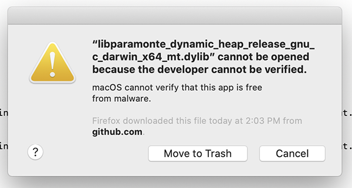
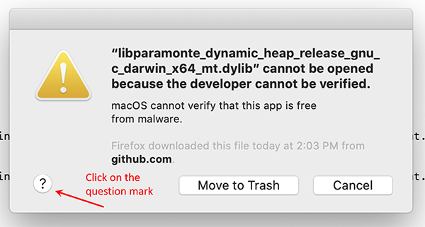
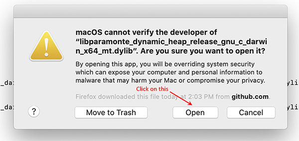


1. [web-link](){:target="_blank"}  
https://www.mathworks.com/matlabcentral/answers/512901-mex-xcodebuild-error-sdk-macosx10-15-4-cannot-be-located
{{site.data.alerts.note}}
{{site.data.alerts.end}}



If the operating system of your machine is **macOS (Darwin)** and you intend to download and use one of the [ParaMonte prebuilt libraries]({{site.releases}}){:target='_blank'} on your macOS system, it is highly likely that the [System Integrity Protection](https://en.wikipedia.org/wiki/System_Integrity_Protection){:target='_blank'} of macOS, in particular, the [macOS Catalina](https://en.wikipedia.org/wiki/MacOS_Catalina) released in 2019 will prevent you from running the ParaMonte kernel libraries on your system.  

Depending on what prebuilt ParaMonte library language you download to use, you may receive an error of different nature, preventing you from calling the ParaMonte libraries on your system. But in most cases, a macOS message window will pop up with a warning message like the following,  

[](./macos_sip_msg_trash.png){:target="_blank"}  

asking you to either move this file to trash because macOS does not know its developer or, cancel your ParaMonte simulation run. This new warning message does not even allow you to override the automatic decision made by the System Integrity Protection (SIP) of macOS to block the application. This is an extremely conservative new approach taken by macOS with the apparent goal of eventually forcing all macOS developers to register a developer account with Apple.  

> This is an example of how corporations become evil by gradually stripping their customers' freedom and rights. People do not need a corporation, Apple, to tell them what they can or cannot use on their purchased equipment, Mac.  

**Steps to override the macOS SIP's automatic blocking of the ParaMonte library:**  

There is still an indirect method of overriding the macOS SIP's authoritarian decision to not run the ParaMonte libraries on your system. We will explain these steps for the case of using the ParaMonte prebuilt libraries for the C programming language. However, these steps are identical in all programming languages, in particular, the MATLAB programming language, in which, one often encounters this issue.  

1.  Suppose you have downloaded one of the ParaMonte prebuilt libraries from the ParaMonte release page on GitHub, for example, [libparamonte_c_darwin_x64_gnu_release_shared_heap.tar.gz]({{site.currentReleaseDownload}}/libparamonte_c_darwin_x64_gnu_release_shared_heap.tar.gz).  
  
1.  When you untar this file and run the `build.sh` command in the uncompressed folder, a `run.sh` script will be generated which you can call to run the supplied ParaMonte example application.  
    ```bash  
    ./build.sh 
    ```  
    ```text  
    -- ParaMonteExampleC - ParaMonte library's full path: /Users/shahmoradia/Downloads/libparamonte_c_darwin_x64_gnu_release_shared_heap/libparamonte_c_darwin_x64_gnu_release_shared_heap.dylib
    -- ParaMonteExampleC - ParaMonte library's full name: libparamonte_c_darwin_x64_gnu_release_shared_heap.dylib
    -- ParaMonteExampleC - ParaMonte library's base name: libparamonte_c_darwin_x64_gnu_release_shared_heap
    -- ParaMonteExampleC - ParaMonte build type: release
    -- ParaMonteExampleC - ParaMonte library type: shared
    -- ParaMonteExampleC - MPI_ENABLED: false
    -- ParaMonteExampleC - CAFTYPE: none
    -- ParaMonteExampleC - ParaMonte library's compiler suite: gnu
    -- ParaMonteExampleC - inferred compiler choice(s): gcc
    -- ParaMonteExampleC - user-selected compiler/linker: none
    -- ParaMonteExampleC - inferred compiler/linker flags(s):  -O3
        
    -- ParaMonteExampleC - compiling ParaMonte example with gcc
    -- ParaMonteExampleC - gcc  -O3  logfunc.c main.c /Users/shahmoradia/Downloads/libparamonte_c_darwin_x64_gnu_release_shared_heap/libparamonte_c_darwin_x64_gnu_release_shared_heap.dylib -o main.exe
        
    -- ParaMonteExampleC - linking ParaMonte example with gcc
    -- ParaMonteExampleC - gcc  -O3  logfunc.o main.o /Users/shahmoradia/Downloads/libparamonte_c_darwin_x64_gnu_release_shared_heap/libparamonte_c_darwin_x64_gnu_release_shared_heap.dylib -o main.exe
    -- ParaMonteExampleC - example build appears to have succeeded.
        
    -- ParaMonteExampleC - To run the example's executable with the proper environmental setup, try:
    -- ParaMonteExampleC - 
    -- ParaMonteExampleC -     source ./run.sh
    -- ParaMonteExampleC - 
    -- ParaMonteExampleC - Look at the contents of run.sh to change the runtime settings as you wish.
    ```  

1.  However, if you run this `run.sh` script on a Bash command line, a warning window may pop up on your Mac screen with a message similar to the following image. **Click on "question mark" in the lower-left corner of this window** as shown below,  
    ```bash  
    ./run.sh 
    ```  
    [](./macos_sip_msg_qmark.png){:target="_blank"}  

1.  Then, a second window from the *macOS User Guide* will pop up like the following. **Click on the link that reads "Open the General pane for me"** as shown below,  
    [](./macos_user_guide_click.png){:target="_blank"}  

1.  Then, a third window from the *macOS Security & Privacy* will pop up like the following. Now, **close the "Security & Privacy" and "macOS User Guide" windows and press `cancel` on the original SIP warning message window** as shown below,  
    [](./close_close_press.png){:target="_blank"}  

1.  Now, **rerun your ParaMonte simulation**. The same SIP warning message window will pop up again. **Repeat the steps described above** to reopen the *macOS Security & Privacy* window. This time, however, you will notice an extra option being added to the *macOS Security & Privacy* pop-up window, as shown below (if you do not see such an extra option, rerun your simulation and repeat the above steps until the additional option appears in the *macOS Security & Privacy* pop-up window). **Select this option "Allow Anyway"**,  
    [](./macos_system_security_allow_anyway.png){:target="_blank"}  

1.  Now, "Close" and `cancel`, once again, all of the pop-up windows. This will also cause the ParaMonte simulation to crash one more time. However, rerunning the simulation another time will result in a new pop-up warning message window with an extra "**Open**" option, as shown below,  
    [](./macos_sip_msg_open.png){:target="_blank"}  
    
-   Done. Once you manage to override the macOS SIP's authoritarian decisions for the specific library that you have downloaded, macOS will not prevent you anymore from running this application on your system. However, if you decide to download another version of the ParaMonte library from the GitHub repository, you will have to likely go through all of these steps again.  



